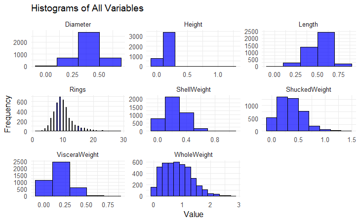
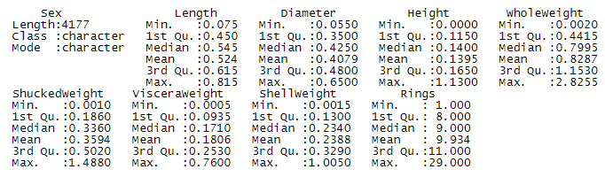
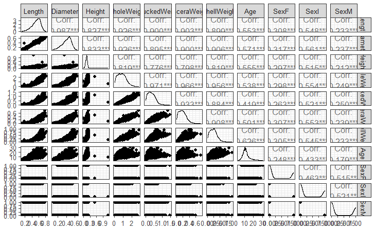
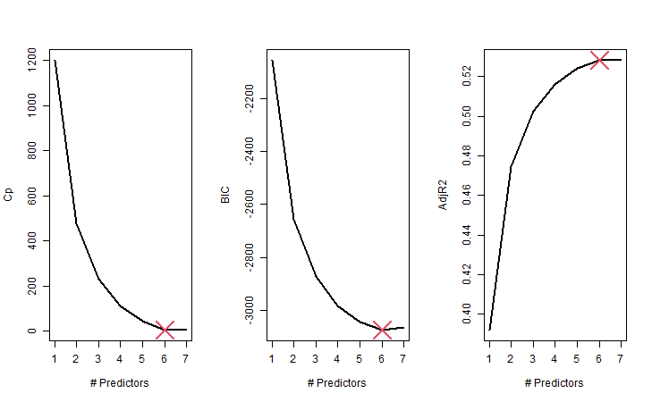
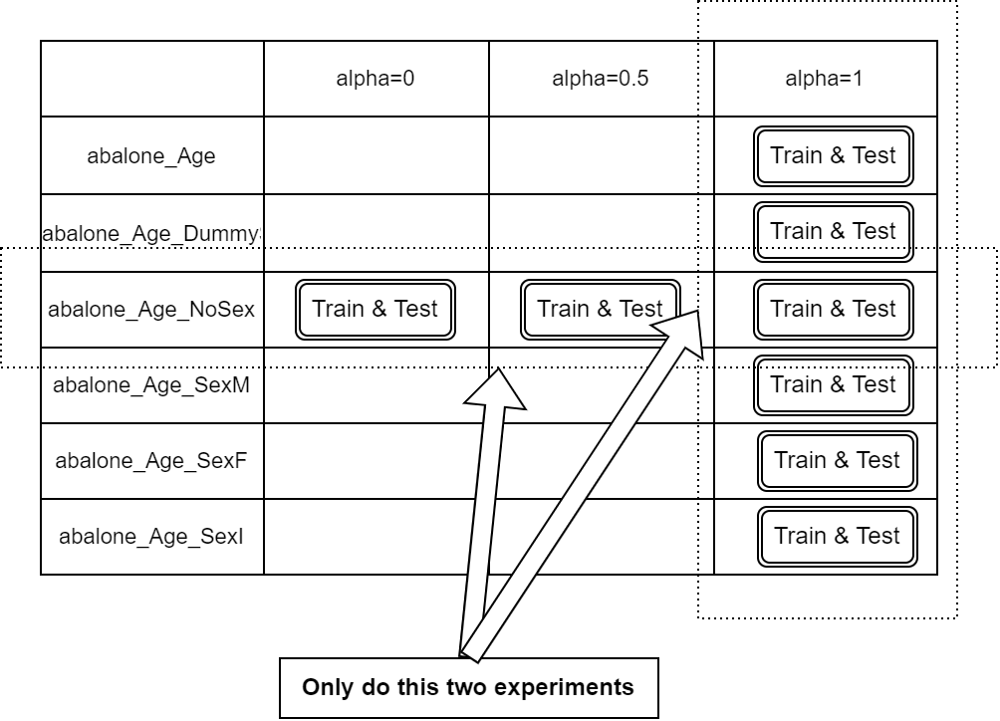
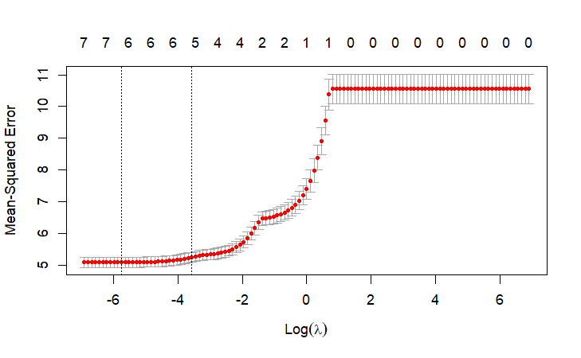
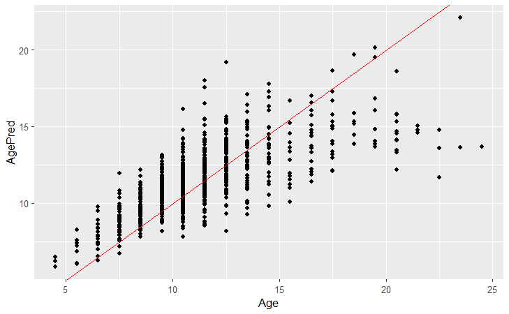

## Introduction

### Background
Traditional methods to determine abalone age involve cutting open the shell, staining it, and counting the rings under a microscope. This process is time-consuming, destructive, and reliant on technician judgment. These issues limit efficiency and accuracy. Alternatively, researchers can predict age through other measurements, though additional data might be necessary, like weather patterns, location, and food supply.

In this report, I leverage the UCI Abalone dataset [1], which contains measurements of abalones, and use R's tidyverse to create a machine learning model to predict ages more accurately.

### Data Set Introduction
The dataset variables are summarized in the following table. The target variable Age isn't directly in the dataset, but can be calculated as Rings + 1.5.

| **Variable Name** | **Type**     | **Description**              | **Units** |
|-------------------|--------------|------------------------------|-----------|
| Sex               | Categorical  | M, F, and I (infant)         | -         |
| Length            | Continuous   | Longest shell measurement    | mm        |
| Diameter          | Continuous   | Perpendicular to length      | mm        |
| Height            | Continuous   | With meat in shell           | mm        |
| Whole_weight      | Continuous   | Whole abalone                | grams     |
| Shucked_weight    | Continuous   | Weight of meat               | grams     |
| Viscera_weight    | Continuous   | Gut weight (after bleeding)  | grams     |
| Shell_weight      | Continuous   | After being dried            | grams     |
| Rings             | Integer      | +1.5 gives the age in years  | -         |

### Model in Use
I used linear regression with Lp regularization and random forest to train the dataset and compared their performance on the test set.

## Data Pre-Processing and EDA

### Data Pre-Processing
**Data Cleaning**  
No typos or missing values were found in the dataset. Using tidyverse, I removed logical inconsistencies:
1. Two instances had a height of 0.
2. Fifteen rows had discrepancies in weight measurements.

**Add Age Column**  
A new Age column was added using the formula `Age = Rings + 1.5` and the Rings column was removed.

**Dealing with Sex Columns**  
The categorical Sex column was converted to binary using one-hot encoding. I added three new columns (SexM, SexF, SexI) and removed the original Sex column.

### Exploratory Data Analysis
**Descriptive Statistics for Single Variables**  
Central tendencies and variability measures were calculated and visualized through histograms.

**Analysis of Correlations Between Variables**  
Bivariate analysis identified relationships between predictors and targets. Correlation charts showed parallel trends between genders and other variables, suggesting little correlation.

**Best Subset Selection**  
Using the `regsubsets` function, I found the best subset in the dataset without the Sex column contained six variables (excluding Height).

## Modeling

### Lp Norm Linear Regression (Ridge, LASSO, and Elastic Net)
**Reason for Choosing Over Decision Trees**  
Lp models provide interpretability through feature weights. LASSO (L1 regularization) helps with feature selection, while Ridge (L2 regularization) handles multicollinearity.

**Model Assumptions**
1. **Linearity**: Assumes a linear relationship between predictors and response variables.
2. **Multicollinearity**: Lp linear regression can tolerate some correlation among predictors.
3. **Alpha/Lambda**: Proper values prevent overfitting/underfitting.
4. **Feature Space Representation**: Input features must be well-prepared.

**Design of Experiment (DoE)**
Five datasets were used for analysis, with three alpha values (0, 0.5, 1) for Ridge, Elastic Net, and LASSO regressions. I designed experiments to verify assumptions.

**Result Analysis**
1. Changing alpha didn't significantly impact RMSE.
2. The RMSE for the Infant dataset was much lower than for others.
3. Best subset results were consistent with previous findings.
4. Ridge regression had the best RMSE.
5. LASSO selected variables effectively.

### Random Forest
**Reason for Choosing Over Neural Networks**  
Random forests offer more interpretability than neural networks and are robust to feature scaling and outliers.

**Model Assumptions**
1. **Variable Correlation**: Random forest minimizes multicollinearity effects.
2. **Overfitting**: Ensemble trees improve accuracy and reduce overfitting.
3. **Feature Importance**: Determines impactful predictors.
4. **Feature Scaling**: Not needed.

**Model Tuning**
Key parameters include ntree (number of trees), mtry (features per split), nodesize, sampsize, and maxnodes. Adjusting these optimizes the model.

**Result Analysis**
Four data models were used, differing by feature inclusion. All models used 500 trees, splitting on two variables at each split. Findings include:
1. Removing specific features had little impact on performance.
2. Training errors were much lower than testing errors, indicating overfitting.
3. Variance explained hovered around 55%.
4. Mean squared residuals were consistent.

## Model Comparison

| **Metric/Model**       | **Lp Linear Regression** | **Random Forest**            |
|------------------------|--------------------------|------------------------------|
| Model Coefficients     | Provided                 | -                            |
| Training Error (RMSE)  | 1.56 - 2.54              | 1.01 - 1.03                  |
| Testing Error (RMSE)   | 1.65 - 2.50              | 2.06 - 2.09                  |
| Running Time           | 0.08 - 0.14s             | 4.35 - 4.51s                 |
| Model Details          | α=0, 0.5, 1              | 500 trees, 2 variables/split |
| Mean Squared Residuals | -                        | 4.72 - 4.76                  |
| Explained Variance     | -                        | 54.83% - 55.27%              |

**Performance**: Similar predictive ability, but random forest explained variance better.  
**Interpretability**: Lp models provide coefficients, making them more interpretable.  
**Efficiency**: Lp regression ran faster than random forest.  
**Non-Linear Relationships**: Random forest is better for non-linear patterns.

**Conclusion**  
Choosing a model depends on interpretability needs and data complexity.

## Results and Conclusion

### Conclusion
Both Lp linear regression and random forest provide valuable insights into predicting abalone age. Lp regression offers interpretability, while random forest handles non-linear patterns.

### Future Work
**Data Collection**  
Include more data points like environmental conditions and use embedded sensors for automated collection.

**Modeling Approaches**  
Try more complex ensemble methods and deep learning. Cross-validate and tune hyperparameters.

### References
- [1]: UCI Abalone Dataset [https://doi.org/10.24432/C55C7W](https://doi.org/10.24432/C55C7W)