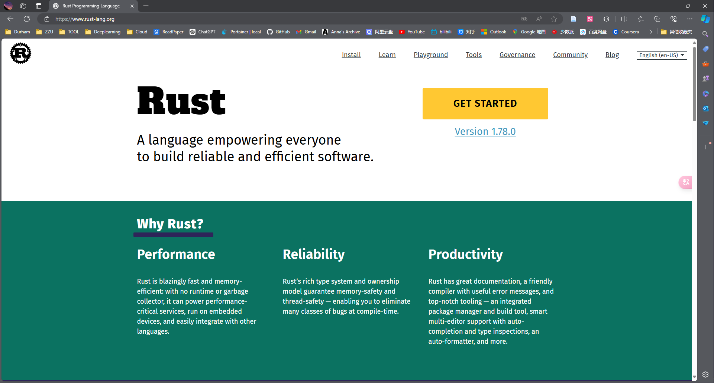
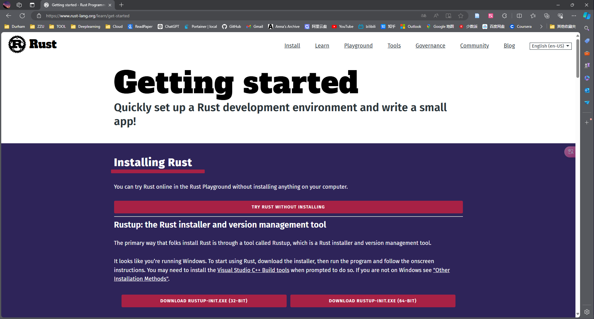
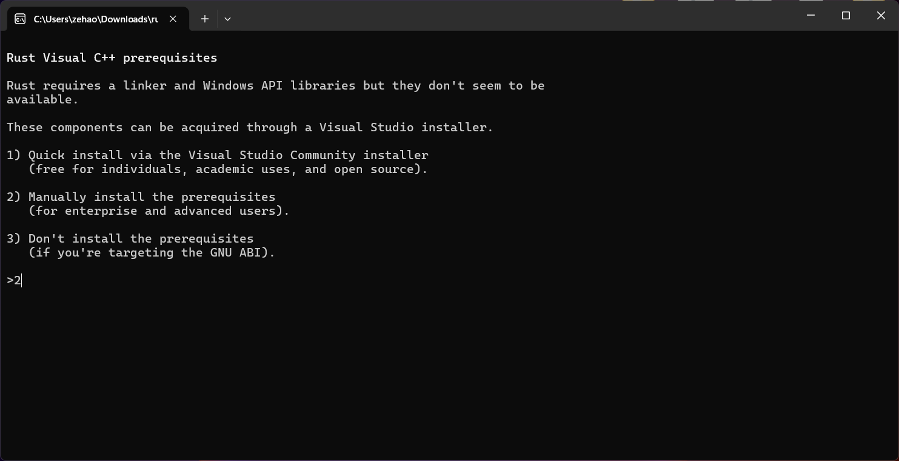
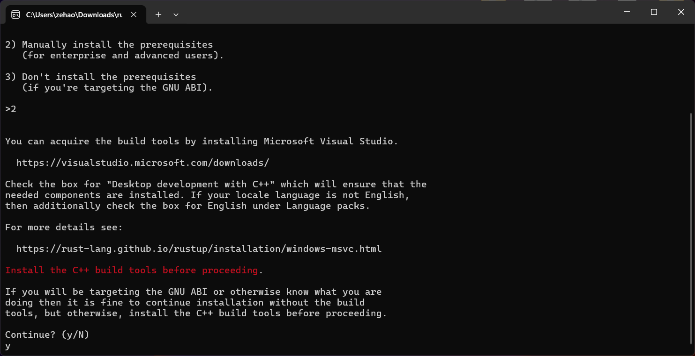
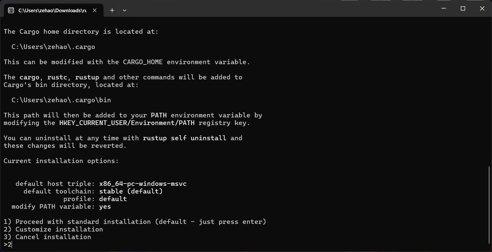
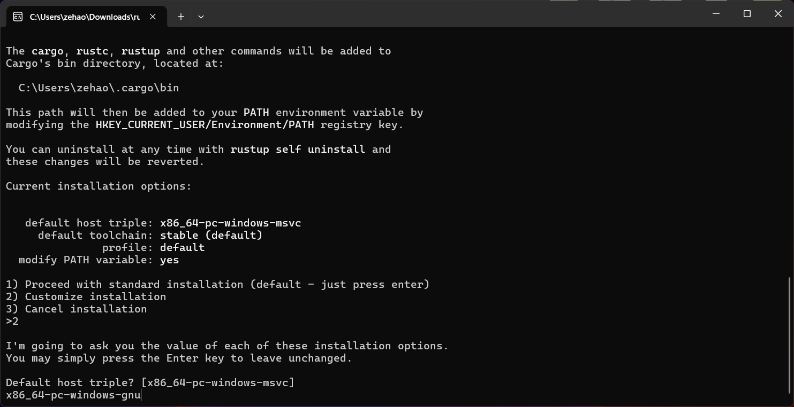
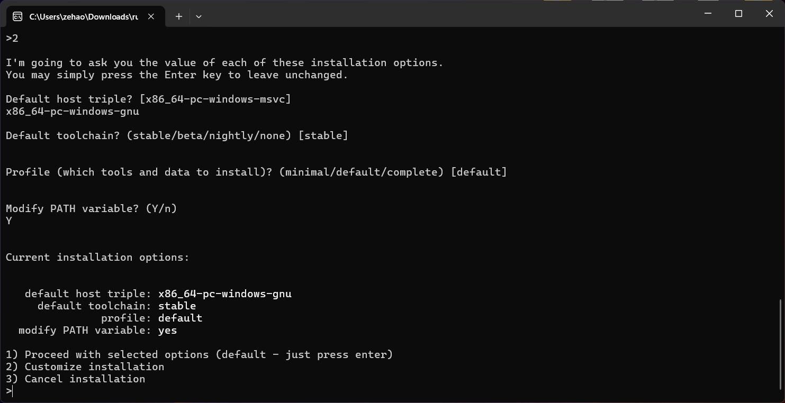

When setting up the Rust programming environment on Windows, I opted to use the GNU GCC compiler to reduce disk usage instead of Microsoft's MSVC. However, one thing that has puzzled me is that many people use MSYS2 to install GCC. In fact, Rust's installer can directly install the GNU toolchain. Here is my installation method:

# Install Rust Package





# Choose Manually install the prerequisites







# Key Step: Choose the Toolchain

```
x86_64-pc-windows-gnu
```



