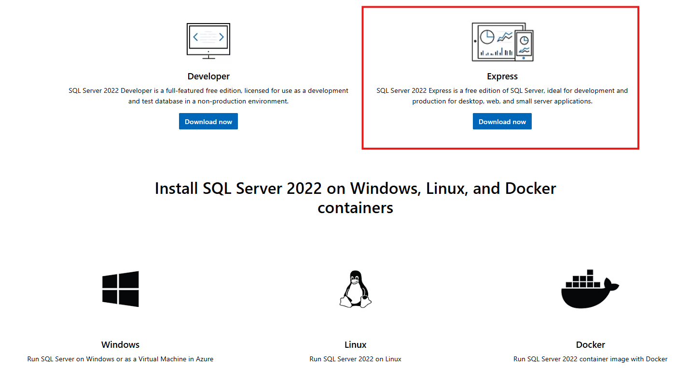

## 1 Deploy SQL Server

### 1.1 In Windows 10/11/Server

Just download MS SQL from [https://www.microsoft.com/en-us/sql-server/sql-server-downloads](https://www.microsoft.com/en-us/sql-server/sql-server-downloads)



This is the traditional way to install, especially for windows server users and beginners. I recommand the SQL Server Express version because it is quite lightwise.

One very important point is that it is best to decide here whether to log in to the database only through Windows authentication or both Windows authentication and SA account login.

If you only select Windows authentication here, you need to download [SSMS](https://learn.microsoft.com/en-us/sql/ssms/) if you want to change to SA login later. Believe me, if you just want to use SQL statements to change the login authentication, it will be very troublesome.

### 1.2 Deploy SQL Server in Ubuntu Docker

I think the following steps are the best way to deploy MS SQL in cloud server like AWS, Azure, Google Cloud, etc. But make sure the cloud server has no less than 2GB memory before run the following command.

* Install Docker in Ubuntu
    ```shell
    curl -fsSL https://get.docker.com | sh
    ```
* Install SQL Server with Docker
    ```bash
    # change <Your_Strong_Password> to your own pwd
    sudo docker run \ 
        -e "ACCEPT_EULA=Y" \
        -e "MSSQL_SA_PASSWORD=<Your_Strong_Password>" \
        -p 1433:1433 --name sql1 --hostname sql1 \
        -d \
    mcr.microsoft.com/mssql/server:2022-latest
    ```

## 2 Connect to SQL Server

### 2.1 Connect with Command Line (only for Windows)

After installing SQL Server and start the service of SQL Server (Express) in **SQL Server Configuration Manager**, you can theoretically run it in the Windows Terminal.

* If you install it in a Windows PC/Server, you can connect the SQL Server with the following command (using windows authentication):

    ```powershell
    sqlcmd -S localhost\SQLEXPRESS -E
    ```

* If you install it in a Windows PC/Server, and you want to use SA login (username and passwd)

    ```powershell
    # if you are using SQL Server Express
    # change <Your_Strong_Password> to your own pwd
    sqlcmd -S localhost\SQLEXPRESS -U sa -P <Your_Strong_Password>
    # if you are using SQL Server Devloper
    # change <Your_Strong_Password> to your own pwd
    sqlcmd -S localhost -U sa -P <Your_Strong_Password>
    ```

The above is a verified method for connecting to a local SQL Server using **sqlcmd**. I have seen online that you can also connect to SQL Server in Mac OS and Linux by downloading the command line tool sqlcmd.

### 2.2 Database Management Application

Although the above methods of connecting to SQL Server using command line tools may seem like a great hacker, they are a little cumbersome. I have also found two graphical tools that make it easier to navigate your computer and connect to SQL Server.

* SQL Server Management Studio

    [https://learn.microsoft.com/en-us/sql/ssms/](https://learn.microsoft.com/en-us/sql/ssms/)

* Azure Data Studio

    [https://learn.microsoft.com/en-us/azure-data-studio](https://learn.microsoft.com/en-us/azure-data-studio)

**Comparison of the two platforms:**

Both platforms are very suitable for checking what tables are in the database and quickly adding, deleting, modifying and checking these tables. Or modify the structure of some tables, such as changing whether the value in a column can be empty or whether it is a primary key.

Just like in the Section 1.1, if you want to change some user authentication graphically, or add some new management members to the database and set their permissions, I think using SQL Server management studio is the best choice.

The Azure data studio platform is more suitable for writing SQL statements. It is a bit like Jetbrains's [DataGrip](https://www.jetbrains.com/datagrip/).

## 3 SQL Operation

Here are some SQL syntax that I recently reviewed that you might be asked during an interview.

### 3.1 For Databases

```SQL
-- Create a database
CREATE DATABASE database_name;
-- Check DB in SQL Server
SELECT name AS db_name FROM sys.databases
-- Use a database
USE database_name;
-- Delete a database, before delete it, change to another db.
USE other_db;
DROP DATABASE database_name;
```

### 3.2 For Tables

```SQL
-- Create a table
-- Select a database firstly
USE database_name;
CREATE TABLE table_name (
    column1 datatype constraints,
    column2 datatype constraints,
    column3 datatype constraints,
    ...
);
```

```SQL
-- Delete a table
DROP TABLE table_name;
-- Delete table data but keep the column names
TRUNCATE TABLE table_name;
```

### 3.3 Insert, delete and update

```SQL
-- Insert a new record in a table
INSERT INTO table_name (column1, column2, column3, ...)
VALUES VALUES (value1, value2, value3, ...);
-- Insert new records together in a table
INSERT INTO table_name (column1, column2, column3, ...)
VALUES VALUES (value11, value21, value31, ...),
              (value12, value22, value32, ...);
```

```SQL
-- Update records in a table
UPDATE table_name
SET column1=value1, column2=value2, ...
WHERE condition;
```

```SQL
-- Delete record
DELETE FROM table_name
WHERE condition
TRUNCATE TABLE table_name;
-- if no condition is added, it will delete all the records but keep the table sturcture. 
-- It would be slower than TRTRUNCATE
DELETE FROM table_name
```

### 3.4 Select

How to get all the data from the table?

```SQL
-- Extract all the records
SELECT * from table_name;
```

If you want to retrieve only some of the columns in a table, you can specify the column names.

```SQL
-- Select some columns
SELECT column1, column2, ... FROM table_name;
```

The `WHERE` clause is used to specify the query conditions. Only data that meets the conditions will be returned.

```SQL
-- Select with conditions
SELECT column1, column2, ... FROM table_name WHERE condition;
SELECT column1, column2, ... FROM table_name WHERE condition1 AND condition2;
SELECT column1, column2, ... FROM table_name WHERE condition1 OR condition2;
```

```SQL
-- Select with ordering
-- Ascend
SELECT column1, column2, ... FROM table_name ORDER BY column1 ASC
-- Descend
SELECT column1, column2, ... FROM table_name ORDER BY column1 DESC
```

```SQL
-- Show top n rows (SQL Server Syntax)
SELECT TOP number column1, column2 FROM table_name;
-- Combined with Order by
SELECT TOP number column1, column2 FROM table_name ORDER BY column1 ASC;
-- if using the other database
SELECT column1, column2 FROM table_name ORDER BY column1 LIMIT number;
```

```SQL
-- Distinct, show different values of one column
-- Also for deleting the same value
SELECT DISTINCT column1 FROM table_name;
```

In an actual database, data is usually stored in multiple tables, and table joins allow you to combine the data in these tables for querying.

* `INNER JOIN` returns only matching rows from both tables.
* `LEFT JOIN` returns all rows from the left table, even if there are no matching rows in the right table, and NULL is returned for the unmatched parts.
* `RIGHT JOIN` is similar to `LEFT JOIN`, but retains all data from the right table, even if there are no matching rows in the left table.

```SQL
-- Join the tables (Inner join)
SELECT table1.column1, table2.column2
FROM table1
INNER JOIN table2
ON table1.common_column = table2.common_column;
-- Left join
SELECT table1.column1, table2.column2
FROM table1
LEFT JOIN table2
ON table1.common_column = table2.common_column;
```

Aggregate functions are used to perform calculations on a set of data, such as sum, average, maximum, minimum, etc. Common aggregate functions include `COUNT()`, `SUM()`, `AVG()`, `MAX()`, `MIN()`.

```SQL
-- using aggregate function, for examle like the function COUNT
SELECT COUNT(column_name)
FROM table_name;
```

`GROUP BY` is used to group data by the value of a column and perform aggregate calculations on each group.

```SQL
SELECT column1, AGGREGATE_FUNCTION(column2)
FROM table_name
GROUP BY column1;
```

`HAVING` is similar to WHERE, but it is used to filter grouped data.

```SQL
SELECT column1, AGGREGATE_FUNCTION(column2)
FROM table_name
GROUP BY column1
HAVING condition;
```

### 3.5 AS

In SQL, the AS keyword is used to set an alias for a column or table, that is, to give a temporary alias to a column or table name, usually used to make query results more readable or to simplify the display of column names. The alias is only used for display and reference and does not change the name of the table or column itself.

```SQL
SELECT column_name AS alias_column_name
FROM table_name AS alias_table_name;
```

### 3.6 Subquery and CTE

A subquery is a query that uses the result of one query statement as the input of another query. Subqueries are usually used in the SELECT, FROM, WHERE, or HAVING clauses.

```SQL
-- Subquery
SELECT column1, column2
FROM (SELECT column1, column2 FROM table_name WHERE condition) AS alias_name
WHERE another_condition;
```

CTE (Common Table Expressions) is another common way to create temporary tables. Its syntax is clearer and easier to read, especially when dealing with complex queries.

```SQL
WITH cte_name AS (
  SELECT column1, column2 FROM table_name WHERE condition
)
SELECT column1, column2
FROM cte_name
WHERE another_condition;
```

