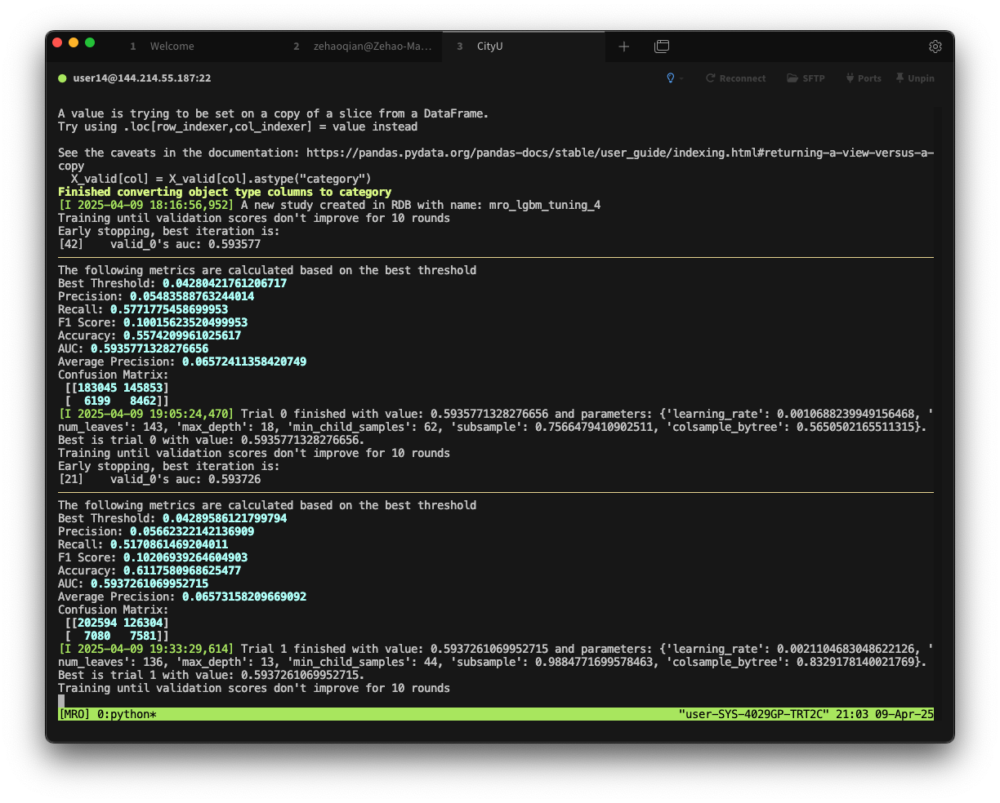

When training machine learning models—especially on remote servers, we often face challenges like:

- Long-running training sessions that take hours or even days  
- Risk of losing SSH connections unexpectedly  
- The need to monitor logs, tweak hyperparameters, or restart jobs without killing the training process  

To handle these situations, developers usually turn to tools that can **keep processes running after the terminal is closed**. The two most common options are: `nohup` and `tmux`.

---

## 🔍 What’s the Difference Between nohup and tmux?

While both tools help keep processes alive, they serve different purposes and offer very different user experiences:

| Feature | `nohup` | `tmux` |
|--------|---------|--------|
| Multiple windows | ❌ No | ✅ Yes |
| Interactive after disconnection | ❌ No | ✅ Yes |
| Real-time output | ❌ Limited (`tail -f` only) | ✅ Fully supported |
| Ease of use | ✅ Very simple | Slightly more complex |
| Persistent session state | ❌ No | ✅ Yes |
| Best use case | One-off scripts or jobs | Long-running training, debugging, monitoring |

---

## ✅ Why I Chose tmux

In my work, I often train deep learning models that run for 10+ hours. During training, I might want to:

- Check logs in real time (e.g., loss, accuracy)
- Make minor changes and restart training
- Visualize training progress with tools like TensorBoard

Here’s why `tmux` works better for me:

- `nohup` is simple, but I **can’t see live output** unless I redirect logs and `tail` them
- `tmux` lets me resume sessions, view output instantly, **split screens**, and **run multiple commands interactively**

Once we get used to it, `tmux` becomes an indispensable tool for anyone working on remote servers.


---

## 🛠 Getting Started with tmux

If you are new to tmux, don’t worry—it’s lightweight, powerful, and quick to learn.

### 🧩 Installation

Ubuntu / Debian:


```shell
sudo apt update
sudo apt install tmux
```

macOS (via Homebrew):

```shell
brew install tmux
```

### 🚀 Start a New Session

```shell
tmux new -s mysession
```

This creates a new session named mysession.

### 🔄 Split Screens
- Horizontal split: `Ctrl` + `b` then `"`
- Vertical split: `Ctrl` + `b` then `%`

### ⏱ Detach and Resume Sessions
- Detach without stopping the process: `Ctrl` + `b`, then `d`
- List existing sessions:

```shell
tmux ls
```

- Reattach to a session:

```shell
tmux attach -t mysession
```

### ❌ Kill a Session

```shell
tmux kill-session -t mysession
```

---

🧪 Real-World Example: Training a Model with tmux



Start a training session:

```shell
tmux new -s train
python train.py --epochs 50 --lr 0.001
```

Then split the window and launch TensorBoard:

```shell
tmux split-window -h
tensorboard --logdir runs
```

We now have a powerful, interactive training environment—all within one terminal window.

---

🧾 Final Thoughts

| Task                    | `nohup`         | `tmux`                |
|-------------------------|------------------|------------------------|
| Simple scripts          | ✅ Great          | ✅ Works              |
| ML training             | ✅ Possible       | ✅ Highly recommended |
| Live log viewing        | ❌ Limited        | ✅ Excellent          |
| Debugging & interaction | ❌ No             | ✅ Yes                |
| Multi-window workflows  | ❌ No             | ✅ Powerful           |

✅ Recommendation: Use nohup for fire-and-forget jobs. Use tmux for serious, interactive work like machine learning training.

---

📚 Further Reading
- [tmux Cheat Sheet](https://tmuxcheatsheet.com/)

If you’ve ever lost hours of training due to a dropped SSH session, give tmux a try—it might just change the way you work on remote servers.

