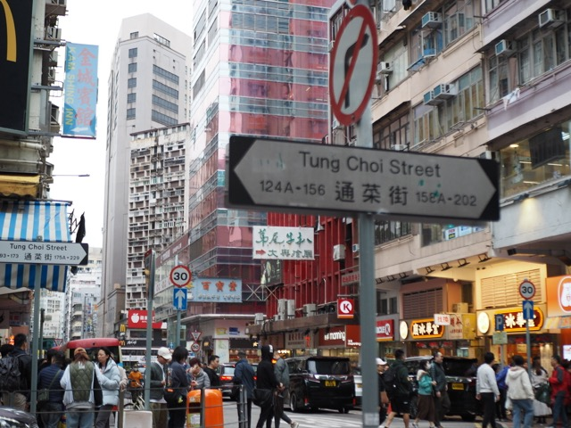
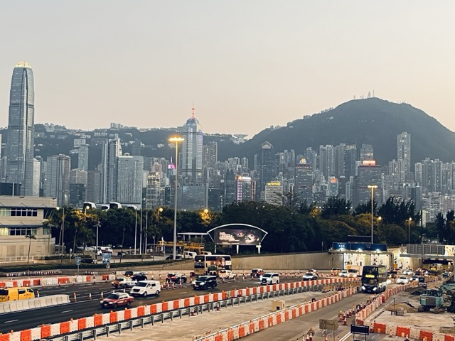
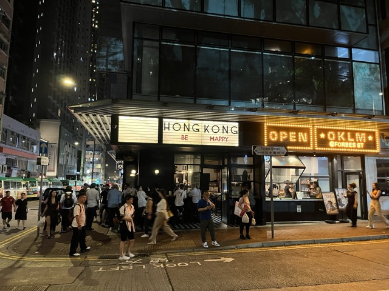

Over the past few months, I have had the honor of working as a research assistant in the Department of Information Systems, School of Business, City University of Hong Kong. This period of time has not only enabled me to gain a lot in the field of scientific research, but also allowed me to experience the unique charm of Hong Kong.

<!-- CityUHK -->

<!-- HK scene -->

The night view of Victoria Peak. When I first saw the night view of Victoria Harbor, I was shocked beyond words. The city lights and the bay complement each other, making it truly worthy of the name "Pearl of the Orient".

<!-- food -->

Tea restaurant culture is also one of the great pleasures of my life in Hong Kong. Every time I order a cup of iced lemon tea, add a pineapple bun or stir-fried beef noodles, it seems that the fatigue of the whole day has been cured.

<!-- Disney -->

Hong Kong Disneyland has always been a fairytale paradise in my heart. Walking into the park that day was like traveling to another world, from Mickey Avenue to the Fantasy Land, and the fireworks show moved me deeply.

