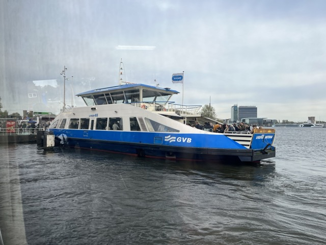
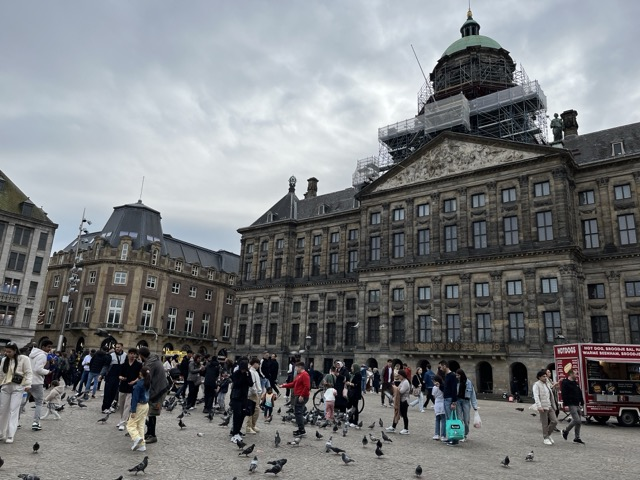
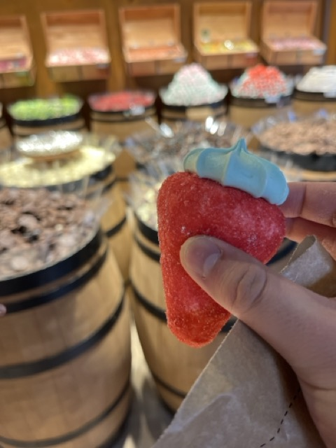
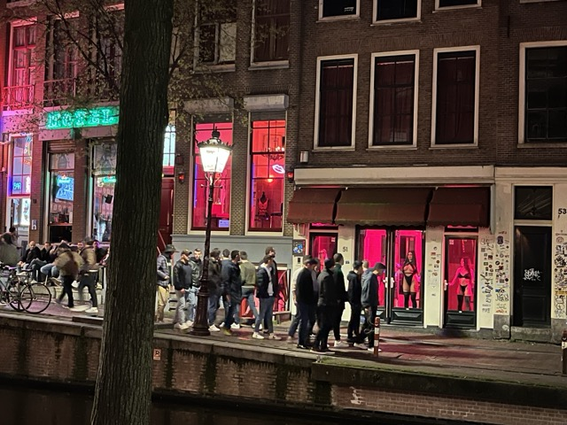
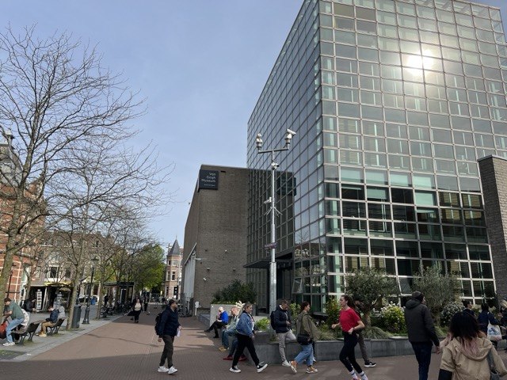
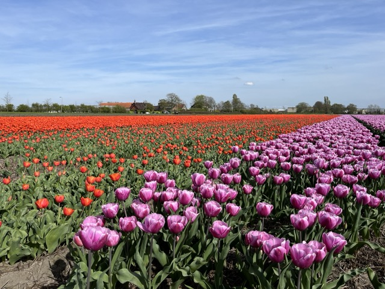
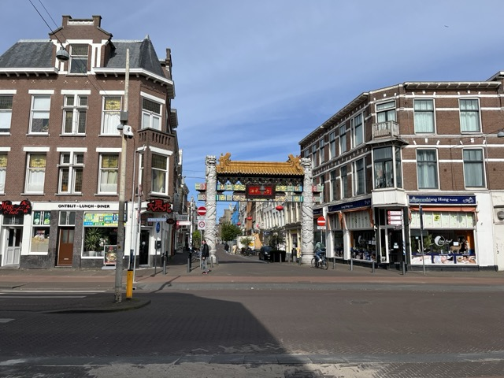
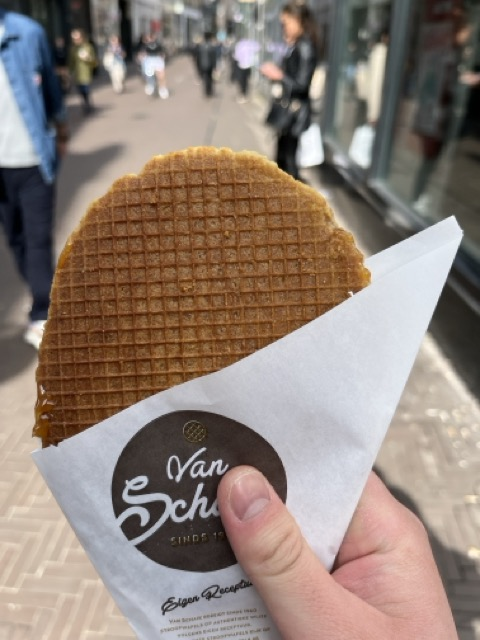
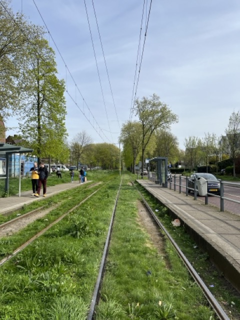

In the early morning light of Amsterdam, sunshine spills through the curtains onto old brick walls—quiet like a painting.

Out in the countryside windmill villages, time seems to slow down, with only the soft clatter of wooden clogs and tulips swaying in the breeze.

