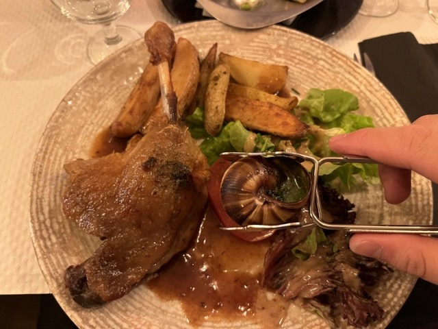
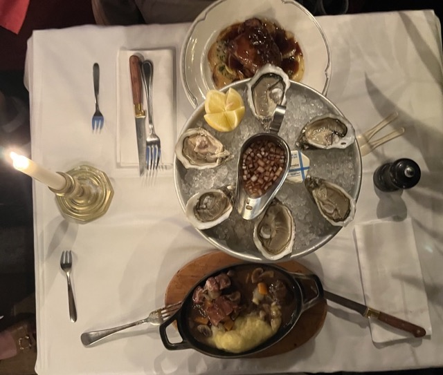
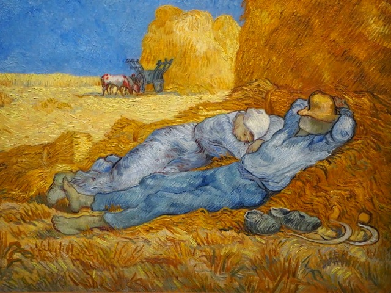

Paris has always been my dream city, and this time I finally have the opportunity to come here (before the start of the Paris Olympics) to experience its romance and beauty.

## Attractions

## Cuisine

## Culture and Art

