🇪🇸 My Trip to Spain: Gaudí’s Barcelona and a Taste of Paella

🏰 Sagrada Família & The Gaudí Trio

One of the most breathtaking highlights of my visit to Barcelona was seeing Antoni Gaudí’s architectural masterpieces.
From the awe-inspiring Sagrada Família, to the dreamlike curves of Casa Milà and Casa Batlló, every detail felt like a dialogue between nature and structure—pure genius.

🍽 Tasting Authentic Spanish Paella

After a day of exploring, I finally got to try the authentic Spanish paella at a cozy local restaurant.
Golden, crispy on the bottom, rich in ocean flavor—one bite, and it felt like the trip had already paid for itself.

📸 Final Thoughts

Travel isn’t just about seeing the sights — it’s about diving into culture and flavor with all your senses.

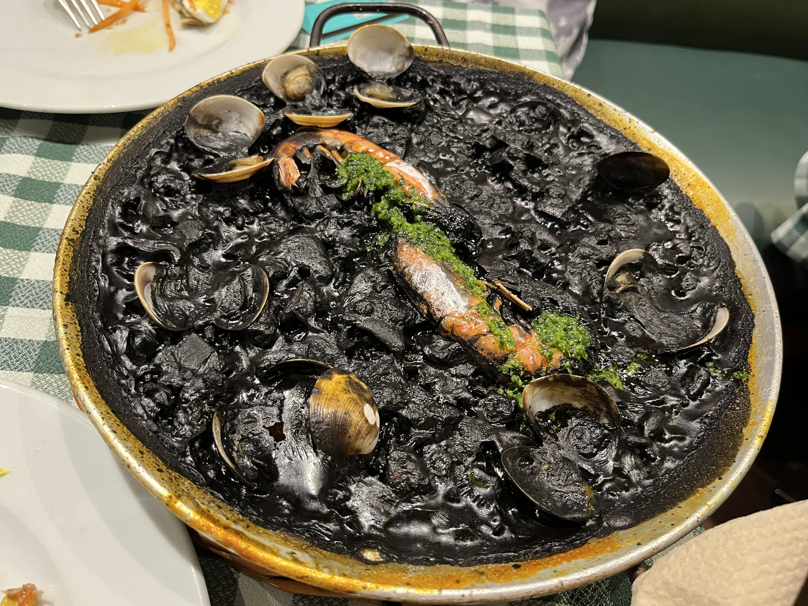

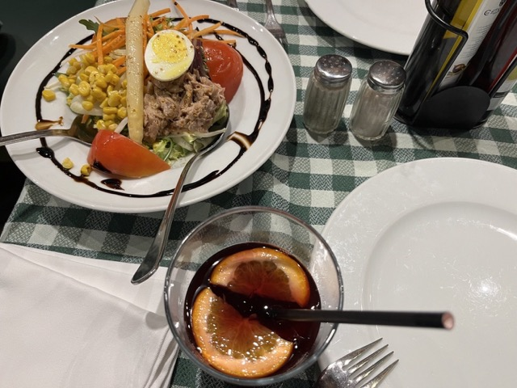

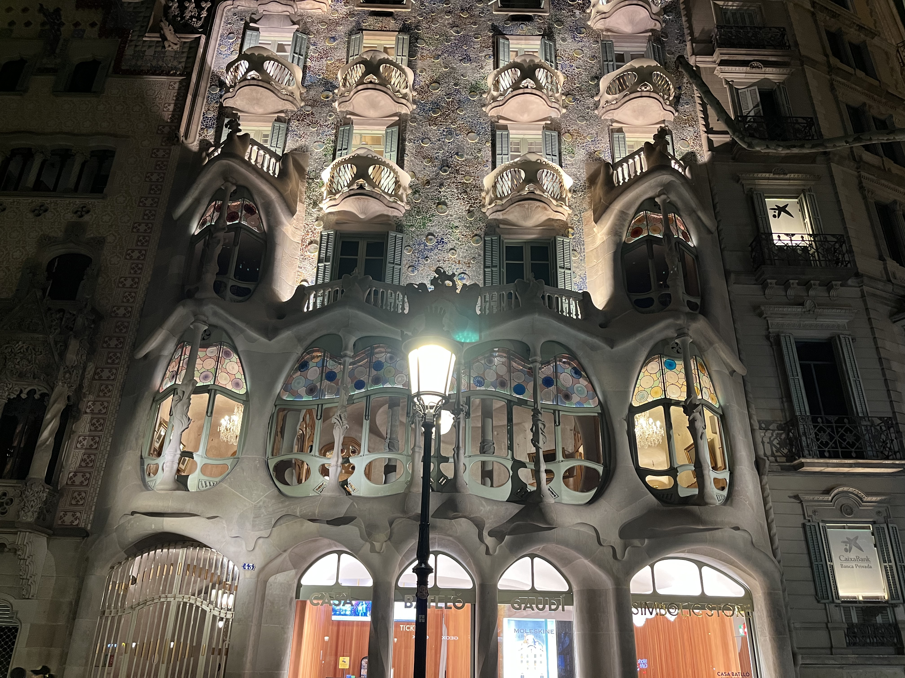

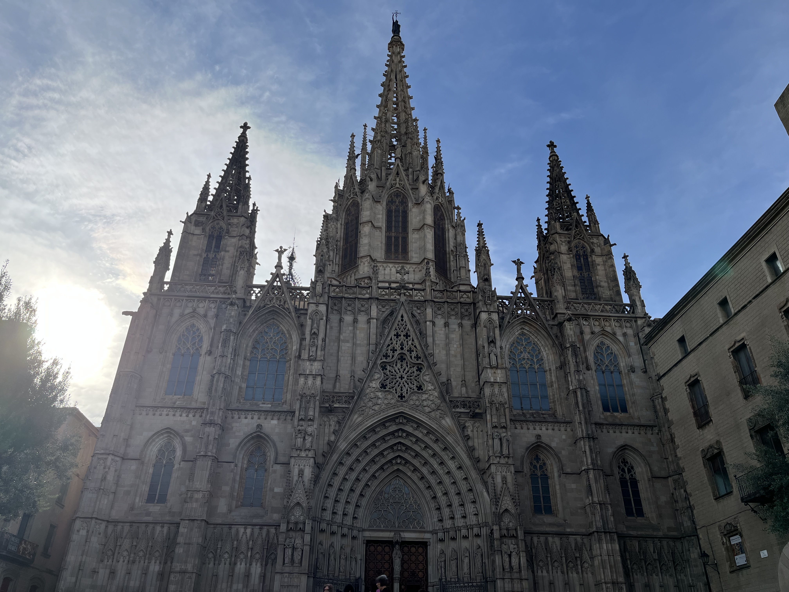

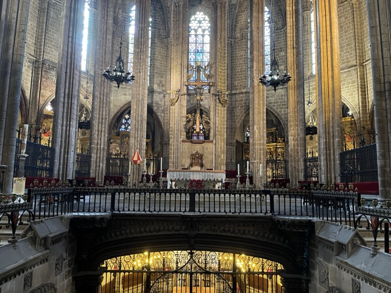

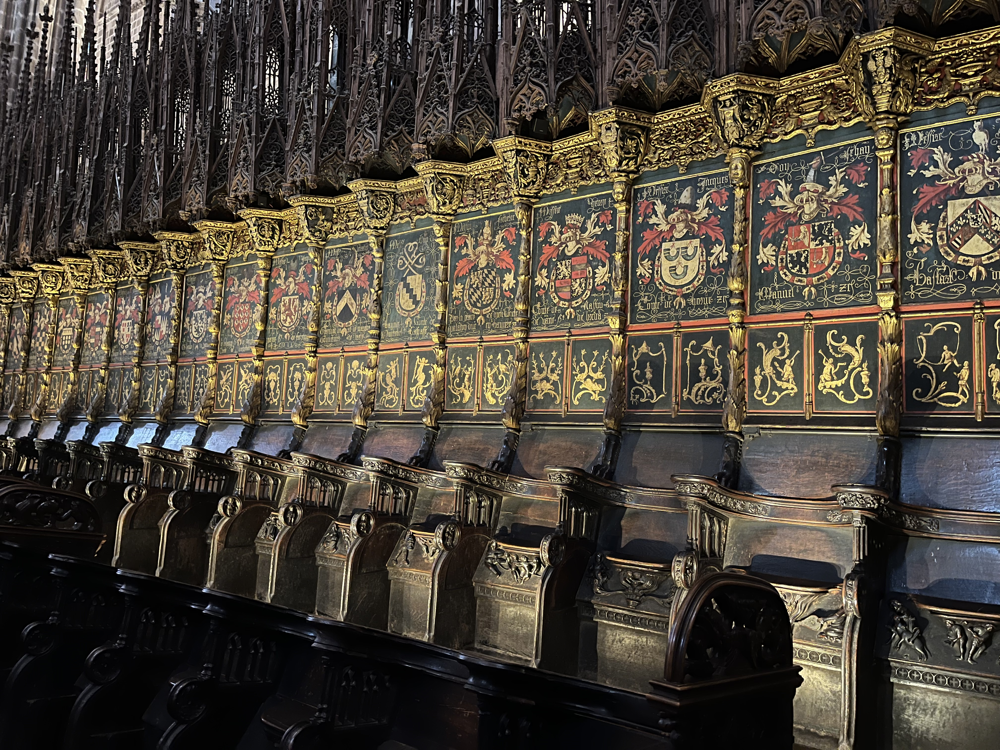

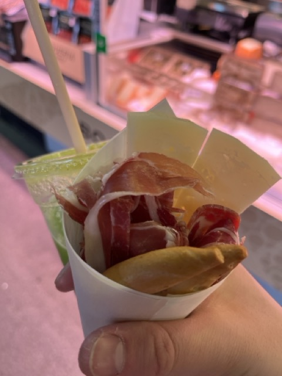

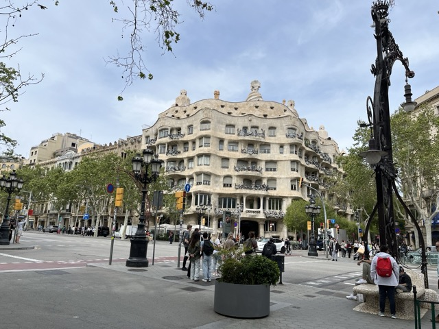

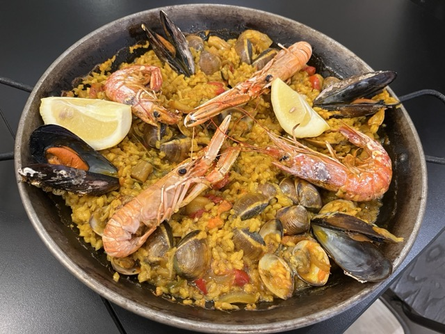

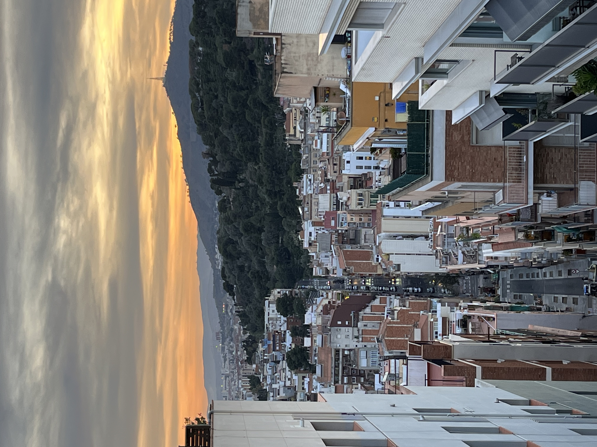

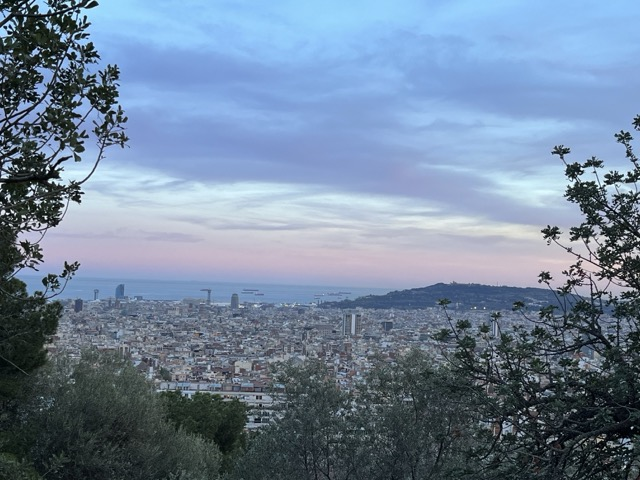

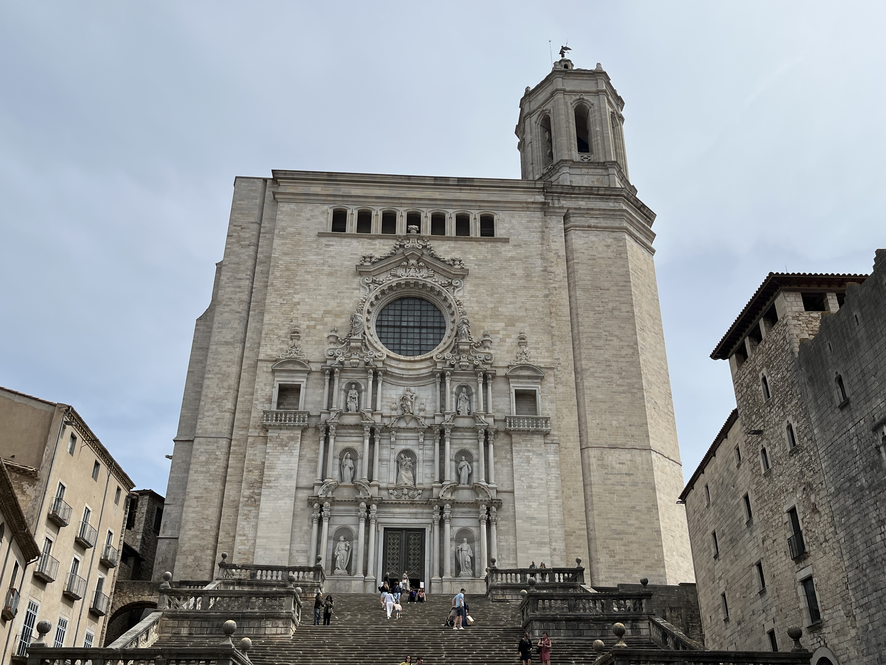

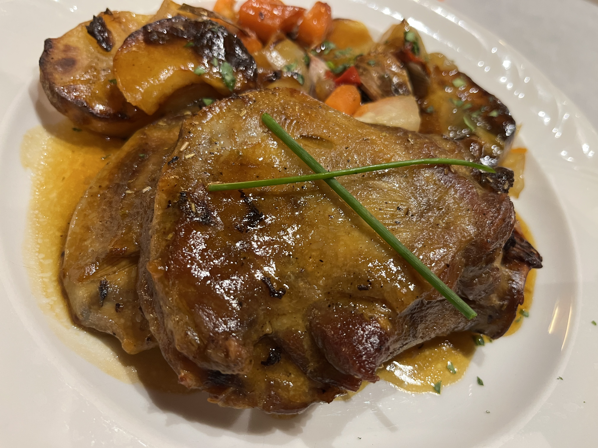

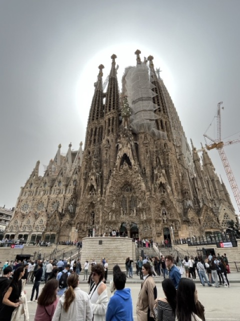

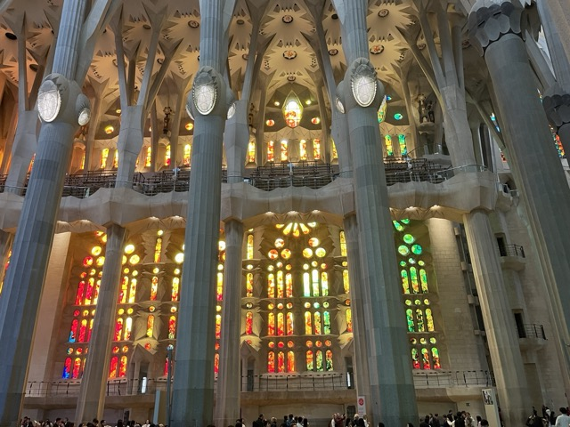

