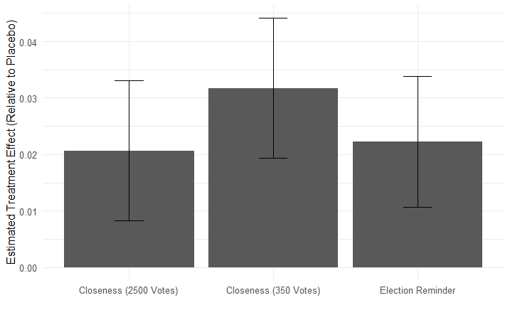

## Table of Contents
1. [Introduction](#introduction)
2. [Research Background](#research-background)
   - [Conception of Election Closeness and Participation](#conception-of-election-closeness-and-participation)
   - [Limitations of Previous Studies](#limitations-of-previous-studies)
3. [Methodology](#methodology)
   - [Multinomial Logistic Regression](#multinomial-logistic-regression)
   - [Descriptive Statistics and Proportions](#descriptive-statistics-and-proportions)
   - [Ordinary Least Squares Regression](#ordinary-least-squares-regression)
   - [Logistic Regression](#logistic-regression)
   - [Interaction Effects, Comparative Effectiveness Analysis](#interaction-effects-comparative-effectiveness-analysis)
   - [Intent to Vote Analysis](#intent-to-vote-analysis)
   - [DiD and Instrumental Variables](#did-and-instrumental-variables)
4. [Code Reproduction with R](#code-reproduction-with-r)
5. [Results and Conclusion](#results-and-conclusion)
   - [Results Analysis](#results-analysis)
   - [Conclusion](#conclusion)

## Introduction
In democratic societies, voter turnout is crucial for legitimacy and representation. Higher voter turnout equates to a more vibrant democratic process. The concept of perceived electoral closeness significantly influences voter behavior, with the Downsian model suggesting that closer elections lead to higher voter turnout. However, empirical studies face challenges in clarifying this relationship due to methodological issues.

This study aims to understand how electoral closeness perceptions influence voter engagement through innovative experimental methods. This research enriches academic insights and provides practical knowledge to improve voter mobilization.

## Research Background

### Conception of Election Closeness and Participation
The theoretical connection between electoral closeness and voter turnout is well-discussed. Various frameworks suggest closer elections motivate higher turnout due to intrinsic rewards, strategic elite behavior, and group benefits. However, causal mechanisms remain ambiguous due to confounding factors such as media attention and campaign activities. Experimental methods are necessary to clarify how perceived closeness affects voter behavior.

### Limitations of Previous Studies
- **Ambiguity in Causal Mechanisms**: Media attention and campaign activities influence voter turnout, complicating the relationship. Minimax regret strategies also add complexity.
- **Potential Confounding Factors**: Factors influencing turnout remain unclear, necessitating experimental manipulation.
- **Generalization and Credibility Issues**: Previous tests struggled with generalizability and credible inference due to framing effects and focus on specific races.

## Methodology
In a seven-state field experiment, all registered voters eligible for primary elections were targeted, and participants were randomly assigned to one of four groups. Messages were delivered via telephone by a professional survey vendor in the four days leading up to each state's primary election. Voter turnout was measured using state voter files to isolate the effect of perceived closeness.

### Multinomial Logistic Regression
This was used to assess balance across covariates like age, gender, and voting history.

$$
\log(\frac{P(Treatment_i=k)}{P(Treatment_i=base)}) = \beta_{0k} + \sum_{j=1}^n \beta_{jk} X_{ji}
$$

### Descriptive Statistics and Proportions
Turnout rates and summary statistics were calculated across different groups.

$$
P_s = \frac{1}{n_s} \sum_{i=1}^{n_s} I(State_i=s \cap Treatment_i=placebo \cap Voted_i)
$$

### Ordinary Least Squares Regression
The model estimates the effect of closeness on voter turnout.

$$
Voted_{2014primary_i} = \beta_0 + \beta_1 Close350not2500_i + \sum_j \beta_j X_{ji} + \epsilon_i
$$

### Logistic Regression
This model is used for binary response data like voter turnout.

$$
\log(\frac{P(Voted_{2014primary_i}=1)}{1-P(Voted_{2014primary_i}=1)}) = \beta_0 + \beta_1 Close350not2500_i + \sum_j \beta_j X_{ji}
$$

### Interaction Effects, Comparative Effectiveness Analysis
This involves generating interaction terms to examine varying effects of closeness messages.

$$
Voted_{2014primary_i} = \beta_0 + \beta_1 CN_i + \beta_2 AU_i + \beta_3 (CN_i \times AU_i) + \sum_j \beta_j X_ji + \epsilon_i
$$

### Intent to Vote Analysis
Analyzing the relationship between intention to vote and actual turnout.

$$
Voted_2014_primary_i = \beta_0 + \beta_1 ITV_i + \beta_2 CN_i + \beta_3 (CN_i \times ITV_i) + \sum_j \beta_j X_{ji} + \epsilon_i
$$

## Code Reproduction with R
The original study used Stata, but the reproduction was done in R. RMarkdown was used to render and export the output.

## Results and Conclusion

### Results Analysis
Comparing the "Closeness 350" treatment to "Closeness 2500," the former increased voter turnout by 1.6 percentage points, a statistically significant result. Regression estimates showed a 1.2 percentage point increase, translating to a 5% higher turnout. The "Closeness 350" message proved most effective across different states and voter histories, resulting in a 13.1% turnout increase over the placebo group.

### Conclusion
Messages emphasizing potential electoral closeness can significantly increase voter turnout. The findings underscore the importance of perceived closeness in voter mobilization and the effectiveness of such messages in increasing participation. Further research should explore the broader applicability and underlying mechanisms.

